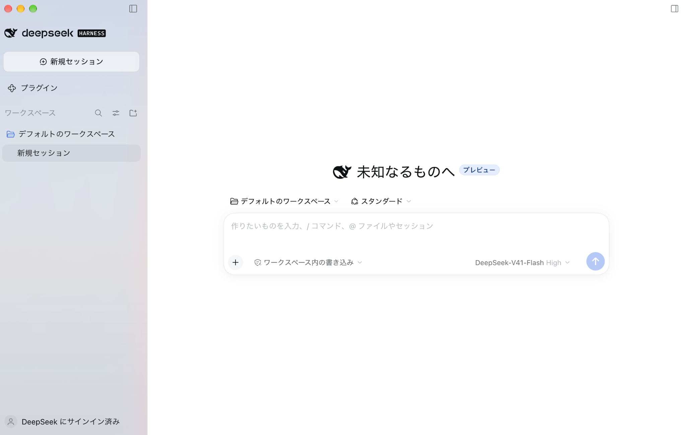
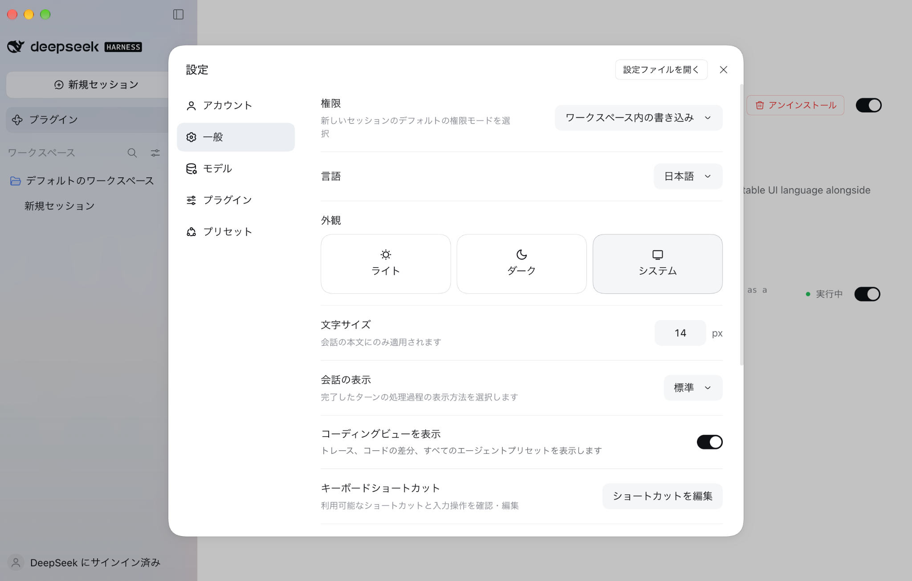

# DeepSeek Harness 日本語ローカライズ

DeepSeek Harness（DSH）の Desktop メイン UI・Web UI に日本語を追加するプラグインです。中文・English・日本語を切り替えて利用できます。

**BAILUO2153 版 · 0.3.1 · DSH 0.2.0-rc.2 対応**

[リリースとダウンロード](https://github.com/BAILUO2153/dsh-locale-ja/releases) · [導入手順](#インストール) · [不具合の報告](https://github.com/BAILUO2153/dsh-locale-ja/issues)

[fang2hou/dsh-locale-ja](https://github.com/fang2hou/dsh-locale-ja) をもとに、BAILUO2153 が翻訳の追加と互換性の調整を行っている fork です。原作者の著作権表示と MIT ライセンスを保持しています。



## インストール

この fork は GitHub Releases で配布します。npm の `@fang2hou/dsh-locale-ja` は原作者の公開版です。この fork の識別名は `@bailuo2153/dsh-locale-ja` です。この scope は GitHub 配布用のパッケージ識別名で、npm のアカウント・scope の所有や公開を示すものではありません。npm のパッケージ名ではなく、以下の `.tgz` を指定してください。

### Release の `.tgz` を使う（推奨）

[この fork の v0.3.1 Release](https://github.com/BAILUO2153/dsh-locale-ja/releases/tag/v0.3.1) から `bailuo2153-dsh-locale-ja-0.3.1.tgz` と SHA-256 チェックサムを取得してください。公開済み `v0.3.0` のタグ・添付物は変更しません。GitHub の自動生成「Source code」アーカイブではなく、添付された `.tgz` を使用します。

1. DSH Desktop のバージョンが `0.2.0-rc.2` であることを確認します。
2. 旧版がある場合は先にアンインストールします（下記参照）。**Plugins → Add plugin**（プラグイン → プラグインを追加）に `.tgz` の絶対パスを入力し、内容を確認してインストール・有効化します。
3. **Settings → General → Language**（設定 → 一般 → 言語）で **日本語** を選びます。

旧版 `@fang2hou/dsh-locale-ja` を導入済みの場合は、先に同じプロファイルのプラグイン管理画面で旧版をアンインストールし、一覧から消えたことを確認してから新版を追加してください。名前が変わるため通常の上書き更新にはなりません。両方を同時に有効化すると日本語の登録が重複するため、併存させないでください。詳細は [Desktop の導入・確認手順](docs/desktop-compatibility.md) を参照してください。

Web プロファイルで旧版がある場合は、まず `dsh plugin --profile web remove @fang2hou/dsh-locale-ja` を実行し、旧版が削除されたことを確認します。その後、ファイルの絶対パスを指定します：

```bash
dsh plugin --profile web add /absolute/path/bailuo2153-dsh-locale-ja-0.3.1.tgz
dsh web
```

### リポジトリを clone してビルドする

Git と [mise](https://mise.jdx.dev/) を用意し、`v0.3.1` タグのソースからパッケージを作成します。Node.js LTS と pnpm 12 は `mise.toml` に従います。

```bash
git clone --branch v0.3.1 --depth 1 https://github.com/BAILUO2153/dsh-locale-ja.git
cd dsh-locale-ja
mise install
mise exec -- pnpm install --frozen-lockfile
mise exec -- pnpm build
mise exec -- pnpm pack --pack-destination dist
```

作成された `dist/bailuo2153-dsh-locale-ja-0.3.1.tgz` の絶対パスを、上記の **Add plugin** に入力します。Web プロファイルなら次のコマンドで導入できます：

```bash
dsh plugin --profile web add "$(pwd)/dist/bailuo2153-dsh-locale-ja-0.3.1.tgz"
dsh web
```

リポジトリにはビルド済み `lib/` も収録し、CI でソースとの一致を検査します。Git URL からの直接インストールは CI の独立した検証対象です。Desktop 同梱パッケージマネージャーでの Git URL 直指定は未検証のため、Desktop では `.tgz` を使用してください。

## 使い方

設定画面で **日本語** を選択すると、対応する UI と日本語システムフォントに切り替わります。言語は DSH の設定として保存され、同じホストに接続するブラウザーにも適用されます。中文・English にはいつでも戻せます。



画像は日本語表示のプレビューです。

日本語を選んだままプラグインを削除すると、追加した辞書・フォント・言語の選択肢が解除されます。保存済みの `ja` 設定は残り、表示は DSH が解決する対応言語に戻ります。再インストール後は保存された日本語設定が再適用されます。

## 対応範囲・検証状況

- 対象：DSH `0.2.0-rc.2` の共有 Web レンダラー（Desktop メイン UI と Web UI）
- 収録：**52 名前空間・2,246 辞書項目**。互換性候補版 `0.3.0-compat.4` の翻訳を引き継ぎ、従来の 1,907 項目を保持しています
- 調査済みで未翻訳の範囲：**6 名前空間・369 項目**。入力用の 6 コマンドトークンは互換性のため英語を保持しています
- 未対応：Electron のネイティブメニュー・更新画面、外部サイトや埋め込みアカウントページ、画像内文字、辞書を使用しない UI、追加プラグインの未収録文字列
- 未翻訳の辞書項目は英語にフォールバックします。DSH 全体の完全日本語化は保証していません
- CI の必須チェック：型チェック・lint・ビルド・辞書／言語サービスのテスト、ビルド済み `lib/` の一致、秘密情報スキャン
- Web E2E：隔離した DSH `0.2.0-rc.2` に、そのコミットの Git URL とソースから生成した `.tgz` を別々に導入します。初期状態、言語切り替えと保存、設定・プリセット画面、アンインストール時の復帰を必須チェックにしています
- 既知の制限：対話モックは旧 `chat/completions` 形式のみ対応し、rc.2 の Messages リクエストに 404 を返します。このテストは独立した非必須ジョブとして実行し、失敗結果と診断を残しています。モデル応答・使用量表示の E2E が通過したことは意味しません。実 API は使用しません
- 以前の `.tgz` は 2 台の Mac で導入が確認されています。今回の `0.3.1` 配布物を使った macOS Desktop の実機確認は別途必要です

最新の実行結果は [この fork の CI](https://github.com/BAILUO2153/dsh-locale-ja/actions/workflows/ci.yml) を参照してください

[翻訳範囲と残りの対象](docs/translation-batch3.md) / [互換性と確認チェックリスト](docs/desktop-compatibility.md)

## フィードバック・開発

誤訳・表示崩れ・この fork の導入問題は [この fork の Issues](https://github.com/BAILUO2153/dsh-locale-ja/issues) に、DSH とプラグインのバージョン、再現手順を添えて報告してください。スクリーンショットの個人情報や認証情報は除いてください。

開発・検証は [DEVELOPMENT.md](DEVELOPMENT.md)、設計は [ARCHITECTURE.md](ARCHITECTURE.md) と [ADR](docs/adr/) を参照してください。

```bash
pnpm install --frozen-lockfile
mise run check
```

## 原作者・ライセンス

原作者：**fang2hou** — [オリジナルの dsh-locale-ja](https://github.com/fang2hou/dsh-locale-ja)。元の実装と日本語翻訳に感謝します。

[MIT License](LICENSE) — `Copyright (c) 2026 fang2hou` を含む原文を変更せず保持しています。
